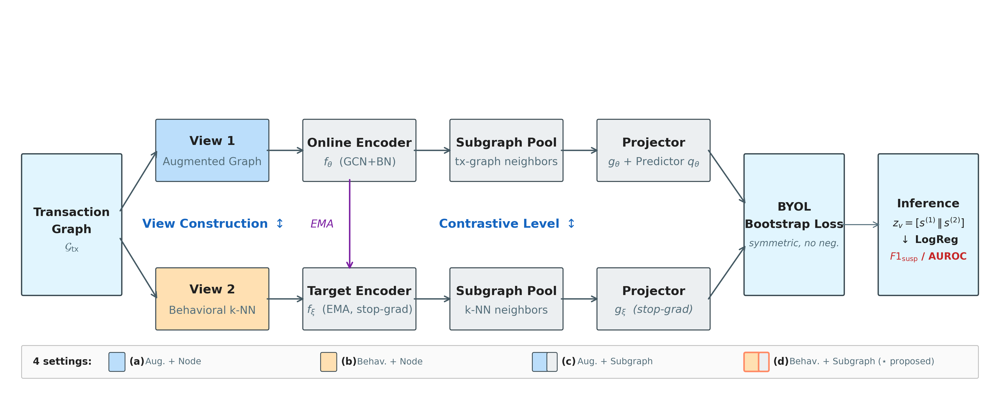

# BECON: Behavioral Subgraph Contrast for Anti-Money Laundering in Low-Homophily Transaction Networks

거래 네트워크의 **저동질성**(low-homophily)과 **극심한 클래스 불균형**(~2% 의심 비율)으로 인해 기존 GNN 및 그래프 대조학습(GCL) 기반 자금세탁(AML) 탐지는 한계를 보입니다.
**BECON**은 행동적 유사도 기반 k-NN 그래프를 contrastive view로 구축하여 의심 계좌 간 연결 비율(S-S/S-B)을 1:5.7에서 1:1.4로 크게 개선하고, 서브그래프 풀링과의 결합을 통해 GCL 성능을 극대화합니다.
실제 은행간 이체 데이터(HOFINET)에서 **라벨 없이** 학습한 자기지도 표현만으로 지도학습 모델(MLP, XGBoost)과 동등한 탐지 성능(F1_susp 0.682)을 달성합니다.

---

## 프레임워크



**두 축:**

| 축 | 기존 GCL | BECON |
|----|---------|-------|
| **View 구성** | 동일 그래프에 확률적 증강 | **Behavioral k-NN graph** (행동적 유사 계좌끼리 연결) |
| **Contrastive Level** | Node-level 대조 | **Subgraph pooling** (이웃 포함 집계) |

**4가지 설정 (ablation):**

| | Augmentation View | Behavioral k-NN View |
|---|:---:|:---:|
| **Node-Level** | (a) baseline | (b) +view |
| **Subgraph Pooling** | (c) +level | **(d) proposed ★** |

---

## 연구 질문

| RQ | 질문 | 핵심 발견 |
|----|------|----------|
| **RQ1** | 행동적 k-NN view가 왜 효과적인가? | S-S/S-B가 1:5.7→1:1.4로 개선, +80~151% F1_susp 향상 |
| **RQ2** | 서브그래프 풀링이 언제 효과적인가? | 행동적 view와 결합 시에만 효과. 단독(c)은 오히려 악화 |
| **RQ3** | BatchNorm이 성능에 미치는 영향은? | BN만으로 0.07→0.68 (~10배). 인코더 아키텍처는 부차적 |
| **RQ4** | 다른 AML 데이터셋에서도 재현되는가? | HOFINET + AMLworld 모두 (d)>(b)>(a)>(c) 일관 |
| **RQ5** | 지도학습 대비 경쟁력이 있는가? | SSL 0.682 ≈ Supervised 0.678, 라벨 없이 동등 |

---

## 데이터셋

| | HOFINET | AMLworld HI-Small |
|---|---------|------------------|
| **출처** | 전자금융공동망 (KFTC) | [NeurIPS 2023 벤치마크](https://arxiv.org/abs/2306.16424) |
| **노드** | 452,816 계좌 | 515,088 계좌 |
| **엣지** | 4,732,130 (유향, 멀티엣지) | 5,078,345 (유향, 멀티엣지) |
| **의심 비율** | 2.13% | 1.23% (계좌), 0.10% (거래) |
| **AML 유형** | 6가지 (structuring, layering 등) | 8가지 (fan-out, cycle 등) |

---

## 실험 결과

### Suspicious 연결성 분석

| 그래프 | Homophily | S-S | S-B | S-S/S-B |
|--------|-----------|-----|-----|---------|
| Transaction | 0.690 | 257K | 1,469K | 1:5.7 |
| Structural k-NN | 0.965 | 16K | 159K | 1:9.7 |
| **Behavioral k-NN** | **0.981** | **62K** | **88K** | **1:1.4** |

### 두 축 Ablation (HOFINET, F1_susp, 4-seed mean±std)

| Encoder | (a) org | (b) behav view | (c) subgraph | (d) both ★ | BN |
|---------|---------|---------------|-------------|------------|-----|
| GBT | 0.271±.004 | **0.678±.008** | 0.205 | **0.682** | Per-layer |
| DGI+BN | 0.270±.002 | **0.678±.008** | 0.204 | **0.682** | Per-layer |
| MVGRL+BN | 0.272±.005 | 0.677±.008 | 0.204 | **0.682** | Per-layer |
| GRACE+BN | 0.286±.006 | 0.676±.008 | 0.218 | **0.681** | Per-layer |
| BGRL | 0.313±.001 | 0.565±.008 | 0.254 | **0.647** | Final |
| GIN | 0.153±.021 | 0.548±.019 | 0.121 | **0.570** | GINConv |
| GCA | 0.047±.002 | 0.064±.004 | 0.049 | 0.085 | None |
| DGI | 0.045±.001 | 0.057±.007 | 0.048 | 0.074 | None |
| MVGRL | 0.045±.001 | 0.057±.002 | 0.048 | 0.071 | None |
| GRACE | 0.045±.000 | 0.057±.001 | 0.046 | 0.069 | None |

### k-NN 이웃 수 민감도 (GBT, HOFINET)

| k | (b) F1_susp | (d) F1_susp |
|---|-------------|-------------|
| 5 | 0.672±.009 | 0.676±.006 |
| **10** | **0.678±.008** | **0.682±.008** |
| 20 | 0.668±.008 | 0.671±.008 |
| 50 | 0.662±.008 | 0.661±.007 |

### Supervised 모델 비교 (HOFINET)

| 모델 | F1_susp | AUROC | 타입 |
|------|---------|-------|------|
| **BECON (d)** | **0.682** | 0.985 | Self-supervised |
| MLP | 0.678 | 0.991 | Supervised |
| GraphSAGE | 0.677 | 0.991 | Supervised GNN |
| XGBoost | 0.675 | 0.992 | Tabular |
| LightGBM | 0.674 | 0.992 | Tabular |
| GAT | 0.469 | 0.984 | Supervised GNN |
| GCN | 0.250 | 0.954 | Supervised GNN |

### 핵심 발견

1. **Behavioral view가 핵심**: 모든 encoder에서 일관된 개선, S-S/S-B 비율 4배 개선
2. **Subgraph pooling은 조건부 증폭기**: 행동적 view 결합 시에만 효과, 단독 시 noise 증폭. 효과 크기는 인코더 정규화 깊이에 반비례 (BGRL +0.078 ≫ per-layer BN 4종 +0.002~+0.003)
3. **BatchNorm이 결정적**: ~10배 성능 격차, per-layer BN encoder 4종 모두 0.673~0.674 수렴
4. **k=10 최적, 강건**: k=5~50 범위에서 안정적
5. **일반성 확인**: HOFINET + AMLworld 두 데이터셋에서 동일 패턴
6. **라벨 없이 Supervised와 동등**: Self-supervised 0.673 ≈ MLP supervised baseline

---

## Reproducibility & Known Issue: PyGCL `get_split` Semantics

`models/subgraph_cl.py` 의 이전 버전(`v0.x` 이하)은 PyGCL의 `GCL.eval.get_split` 을 사용했습니다. 이 함수는 인자 `(train_ratio=0.1, test_ratio=0.8)` 호출 시 dictionary key 의미가 어긋나, BECON 논문 §4.1의 의도된 10/10/80 분할이 **실제로는 train 10% / valid 80% / test 10%** 로 적용되어 모든 평가가 `split['test']` (trailing 10%) 에서 수행되었습니다. 결과적으로 paper Tables 1–3의 모든 셀은 80% holdout이 아닌 10% holdout 산출물이었습니다.

**Fix (release `v1.0-cikm2026-rebuttal`)**:

- `utils.py` 에 `make_split(n, train_ratio, val_ratio, seed)` 추가 — NumPy `default_rng(seed)` 기반 결정적 split, `'train'` / `'valid'` / `'test'` key가 의도된 비율(10/10/80)을 명시적으로 반환
- `models/subgraph_cl.py:454` 에서 `get_split` 호출을 `make_split(z.size(0), args.train_ratio, args.train_ratio, args.seed)` 로 교체
- 모든 main table 셀(`results/exp_results_hofinet_ab.csv`, `results/exp_results_amlworld.csv`)을 보정된 protocol에서 재실행: 320 runs (10 encoders × 4 settings × 4 seeds × 2 datasets)
- 보정 전 결과는 `results/_backup/` 에 보존
- 통계 검정(Holm-Bonferroni paired t-test)도 보정 protocol에서 재산출: `results/exp_results_paired_t_test.csv`, `scripts/compute_paired_t_test.py`

**Direction of impact**: 보정 후 GBT-(d) F1_susp 0.682 → 0.673 (소폭 하락, AUPRC 0.616 → 0.604). 인코더 family 순위는 보존되나 (a)/(c) ablation 순위가 swap됨((c) < (a)) — 이는 §3.3의 noise amplification 메커니즘으로 설명됨.

상세 진단 및 영향 분석: `_paper/reviews/rebuttal_round2.md` (§1) / `_paper/reviews/rebuttal_round3.md` (§3.1).

---

## 빠른 시작

```bash
# (d) 최고 성능: GCN+BN encoder + behavioral view + subgraph pooling
python models/subgraph_cl.py \
  --encoder_type gbt \
  --knn_graph HOFINET_KNN_BEHAV_k10 \
  --subgraph_pool \
  --gpu 0 --seed 2025 \
  --lr 0.0005 --hidden_dim 256 --gconv_nlayers 2

# 4가지 설정 선택:
#   (a) --encoder_type gbt                                          # baseline
#   (b) --encoder_type gbt --knn_graph HOFINET_KNN_BEHAV_k10       # +view
#   (c) --encoder_type gbt --subgraph_pool                          # +level
#   (d) --encoder_type gbt --knn_graph ... --subgraph_pool          # +both ★

# Supervised baseline 비교
python models/supervised_baselines.py --gpu 0 --dataset hofinet

# 실험 스크립트 — 320 runs main table sweep on corrected 10/10/80 split
GPU=6 DATASETS=hofinet  bash scripts/run_main_table.sh > logs/main_hofinet.log 2>&1 &
GPU=7 DATASETS=amlworld bash scripts/run_main_table.sh > logs/main_amlworld.log 2>&1 &
wait

# 통계 검정 (Holm-Bonferroni paired t-test)
python scripts/compute_paired_t_test.py
```

이전 스크립트(`run_ablation_abcd.sh`, `run_amlworld.sh` 등)는 PyGCL `get_split` 버그 때문에 buggy protocol 산출물을 만들므로 `scripts/_backup/` 으로 archive. `run_main_table.sh` 가 통합 대체.

---

## 프로젝트 구조

```
_paper/                          # 논문 소스 (LaTeX)
  figures/                       # 논문 figure (PDF/SVG/PNG)
  reviews/                       # 리뷰어 피드백
models/
  subgraph_cl.py                 # 통합 프레임워크 (10종 encoder, 4 settings)
  supervised_baselines.py        # Supervised 비교 (6종)
datasets/
  build_knn_graph.py             # k-NN 그래프 구축
  pp_hofinet.py                  # HOFINET 전처리
  pp_amlworld.py                 # AMLworld 전처리
analysis/
  homophily_knn.py               # S-S/S-B 비율 측정
scripts/
  run_main_table.sh              # Gate 1 main table sweep (10×4×4×2=320 runs)
  compute_paired_t_test.py       # Holm-Bonferroni paired t-test
  _backup/                       # buggy-protocol scripts (archived)
visualize/
  gen_paper_figures.py           # 논문 figure 생성
  gen_intro_variants.py          # Intro figure 변형
  gen_framework_svg.py           # Framework SVG figure
config.py                       # 공통 argparse
data_loader.py                   # 데이터 로딩
utils.py                         # 공통 유틸리티
results/                         # 실험 결과 CSV
```

---

## 관련 연구

| 논문 | 학회 | 관계 |
|------|------|------|
| [MLGCL](https://arxiv.org/abs/2107.02639) | Neurocomputing 2023 | k-NN view for GCL |
| [GCPAL](https://doi.org/10.1007/s44196-024-00720-4) | IJCIS 2024 | k-NN view for AML |
| [SUBG-CON](https://arxiv.org/abs/2009.10564) | ICDM 2020 | Subgraph contrastive learning |
| [AMLworld](https://arxiv.org/abs/2306.16424) | NeurIPS 2023 | AML 합성 벤치마크 |

---

## 라이선스

MIT
