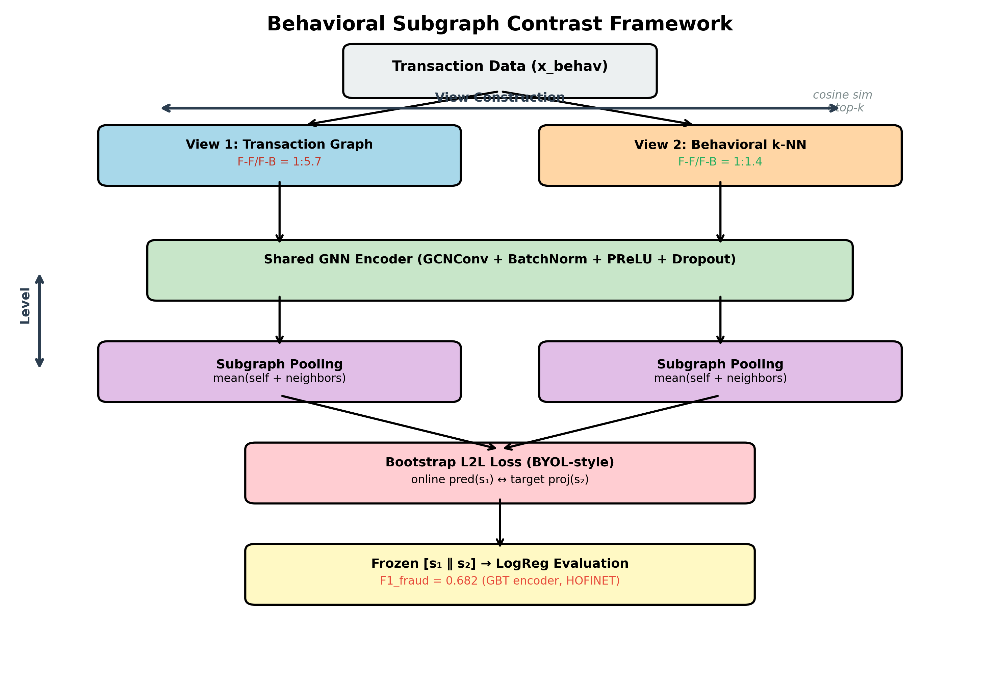

# Beyond Augmentation: Behavioral Subgraph Contrast for AML

자금세탁(AML) 탐지를 위한 그래프 대조학습(GCL)에서 **View 구성**과 **Contrastive Level**, 두 독립 축을 분석하고 최적 조합을 제안합니다.

> [FraudCenGCL (BigData 2025)](https://github.com/sklim84/KA-003-FraudCenGCL) 확장 연구

## 핵심 아이디어



| 축 | 질문 | 제안 |
|----|------|------|
| **View 구성** | 어떤 그래프를 contrastive view로 쓸 것인가? | Behavioral k-NN graph |
| **Contrastive Level** | 어떤 수준에서 대조할 것인가? | Subgraph-level pooling |

```
                        View 구성
                   Augmentation    Behavioral k-NN
Contrastive  Node │ (a) baseline  │ (b) view 변경    │
Level        Sub  │ (c) level 변경│ (d) 최종 제안    │
```

## 연구 질문

| RQ | 질문 | 비교 |
|----|------|------|
| RQ1 | Behavioral view가 효과적인가? | (b) vs (a) |
| RQ2 | 왜 효과적인가? | F-F/F-B 비율, homophily |
| RQ3 | Subgraph pooling이 효과적인가? | (c) vs (a) |
| RQ4 | 두 축의 결합에 시너지가 있는가? | (d) vs (b), (c) |
| RQ5 | 다양한 encoder에서 일관되는가? | 10종 encoder (GCN/GIN, BN 유무) |

## 데이터셋

### HOFINET (Primary) — 실제 은행간 이체

| 항목 | 값 |
|------|-----|
| 계좌 (노드) | 452,816 |
| 이체 (엣지) | 4,732,130 (유향, 멀티엣지) |
| 의심 계좌 | 9,644 (2.13%) |
| 기간 | 2021 Q3 ~ 2024 Q4 (40개월) |
| AML 유형 | 6가지 (structuring, layering 등) |

### AMLworld (Secondary) — 일반성 검증용 합성 벤치마크

| 항목 | 값 |
|------|-----|
| 데이터셋 | HI-Small (GCPAL 비교용) |
| 구조 | 유향 멀티그래프 (HOFINET과 동일) |
| 출처 | [NeurIPS 2023 Datasets & Benchmarks](https://arxiv.org/abs/2306.16424), Kaggle 공개 |

## 피처 분류

| Category | 수 | 설명 | GNN 입력 | k-NN 구축 |
|----------|-----|------|----------|----------|
| **A. Behavioral** (x_behav) | 22 | 금액통계, entropy, temporal | O | Behavioral k-NN |
| **B. Structural** (x_struct) | 9 | centrality, degree | O (선택) | - |

## Fraud 연결성 분석 (RQ2)

| 그래프 | F-F/F-B 비율 | 의미 |
|--------|-------------|------|
| Transaction | 1:5.7 | fraud가 benign에 묻힘 |
| Structural k-NN | 1:9.7 | 더 심하게 묻힘 |
| **Behavioral k-NN** | **1:1.4** | **fraud 신호 보존** |

## 실험 결과 (F1_fraud, 4-seed 평균, HOFINET 멀티엣지)

### (a)(b)(c)(d) Ablation (통합 프레임워크, bootstrap L2L)

**BN 있는 Encoder (GCNConv 기반)**

| Encoder | (a) org | (b) behav view | (c) subgraph | (d) both | BN | Conv |
|---------|---------|---------------|-------------|----------|-----|------|
| **GBT** | 0.270 | **0.678** (+151%) | 0.205 (-24%) | **0.682** (+152%) | ✅ | GCN |
| **DGI+BN** | 0.271 | **0.678** (+150%) | 0.204 (-25%) | **0.682** (+152%) | ✅ | GCN |
| **MVGRL+BN** | 0.270 | **0.677** (+151%) | 0.204 (-24%) | **0.682** (+153%) | ✅ | GCN |
| **GRACE+BN** | 0.286 | **0.676** (+136%) | 0.218 (-24%) | **0.681** (+138%) | ✅ | GCN |
| **BGRL** | 0.315 | 0.566 (+80%) | 0.254 (-19%) | **0.647** (+105%) | ✅ | GCN |
| **GIN** | 0.149 | **0.545** (+266%) | 0.121 (-19%) | **0.570** (+283%) | ✅ | GIN |
| GCA | 0.048 | 0.064 (+31%) | 0.049 (+2%) | 0.085 (+75%) | ❌ | GCN |
| DGI | 0.045 | 0.058 (+29%) | 0.048 (+7%) | 0.074 (+64%) | ❌ | GCN |
| MVGRL | 0.045 | 0.056 (+24%) | 0.048 (+7%) | 0.071 (+56%) | ❌ | GCN |
| GRACE | 0.045 | 0.056 (+27%) | 0.046 (+4%) | 0.069 (+54%) | ❌ | GCN |

### 핵심 발견

1. **(b) Behavioral view**: 모든 encoder에서 일관된 개선. BN encoder +80~151%, non-BN +24~29%
2. **(c) Subgraph 단독**: BN encoder에서 오히려 악화 (-19~25%). transaction graph의 낮은 F-F/F-B 비율(1:5.7) 증폭
3. **(d) 결합이 최고**: 모든 encoder에서 (d) > (b) > (a) > (c)
4. **BN이 결정적**: BN 추가만으로 0.07 → 0.68 (~10배). 모든 per-layer BN encoder가 동등 성능 (0.681~0.682)
5. **GCNConv + per-layer BN이 최적**: GCN+BN encoder 모두 동등 (0.681~0.682). GIN+BN은 차선 (0.570)
6. **제안 방법은 encoder 독립적**: behavioral view + subgraph pooling은 모든 encoder에서 일관된 상대적 개선 (+54~283%)

## 빠른 시작

```bash
# (d) 최고 성능 설정
python models/subgraph_cl.py \
  --knn_graph HOFINET_KNN_BEHAV_k10 \
  --subgraph_pool --encoder_type gbt \
  --gpu 0 --seed 2025 \
  --lr 0.0005 --hidden_dim 256 --gconv_nlayers 2

# (a)(b)(c)(d) 설정 선택
#   (a) --encoder_type gbt                          # aug view + node-level
#   (b) --encoder_type gbt --knn_graph ...          # behav view + node-level
#   (c) --encoder_type gbt --subgraph_pool          # aug view + subgraph
#   (d) --encoder_type gbt --knn_graph ... --subgraph_pool  # both

# 전체 ablation 실험
bash scripts/run_full_ablation.sh

# 지원 encoder: bgrl, gbt, grace, dgi, mvgrl, dgi_bn, mvgrl_bn, grace_bn, gca, gin
```

## 프로젝트 구조

```
models/
  subgraph_cl.py               # 통합 프레임워크 (10종 encoder, 4 settings)
  bgrl_w_knn.py                # BGRL + k-NN view (+ --subgraph_pool)
  dgi_transductive_w_knn.py    # DGI-trs + k-NN view (+ --subgraph_pool)
  mvgrl_w_knn.py               # MVGRL + k-NN view (+ --subgraph_pool)
  *_w_org.py                   # Baseline (+ --subgraph_pool)
datasets/
  build_knn_graph.py           # k-NN 그래프 구축
  pp_hofinet.py                # HOFINET 전처리
analysis/
  homophily_knn.py             # F-F/F-B 비율 측정
scripts/
  run_full_ablation.sh         # 전체 ablation 실험
```

## 관련 연구

| 논문 | 학회 | 관계 |
|------|------|------|
| [MLGCL](https://arxiv.org/abs/2107.02639) | Neurocomputing 2024 | k-NN view for GCL |
| [GCPAL](https://doi.org/10.1007/s44196-024-00720-4) | IJCIS 2024 | k-NN view for AML |
| [SUBG-CON](https://arxiv.org/abs/2009.10564) | ICDM 2020 | Subgraph CL |
| [ImGCL](https://ojs.aaai.org/index.php/AAAI/article/view/26319) | NeurIPS 2023 | Imbalanced GCL |

**차별점**: 기존 연구는 view 구성 또는 contrastive level을 개별적으로 다룸. 본 연구는 **두 축을 교차 분석**하여 AML에 최적인 조합을 도출. 또한 **BN이 대규모 불균형 환경에서 결정적**임을 10종 encoder 비교로 입증.

## TODO

- [x] (a)(b)(c)(d) ablation × 10 encoder (GCN/GIN, BN 변형, GCA)
- [ ] AMLworld HI-Small 데이터셋 — 일반성 검증, GCPAL 직접 비교
- [ ] SOTA AML 모델 비교

## 라이선스

MIT
